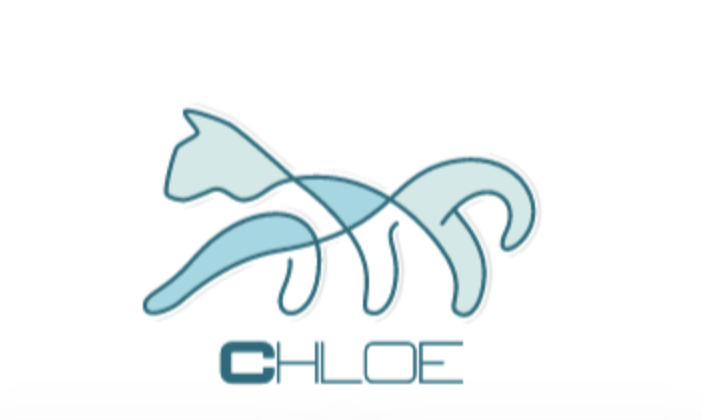

# Chloe
The languge of Chloe, named after my daughter, will be a fun language that's purpose will be readability and understanding.
I'm more than positive I will add more functionality or change certain aspects of this language, but as of now
it's purpose will be to be a fun and silly language.
# Example functions
|Chloe|Javascript|
|-----|----------|
|toy x = 4|let x = 4|
|show ["Hello World"]|console.log("Hello World")|

